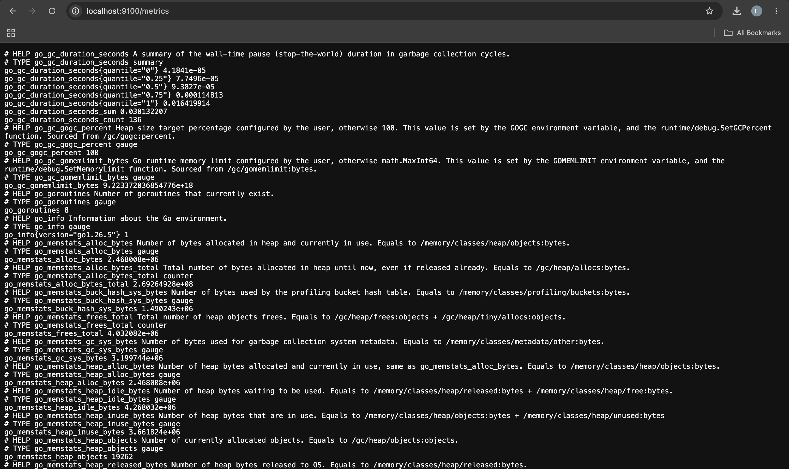
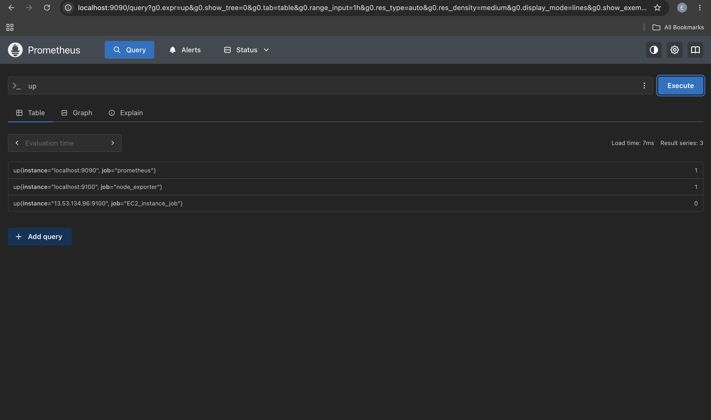
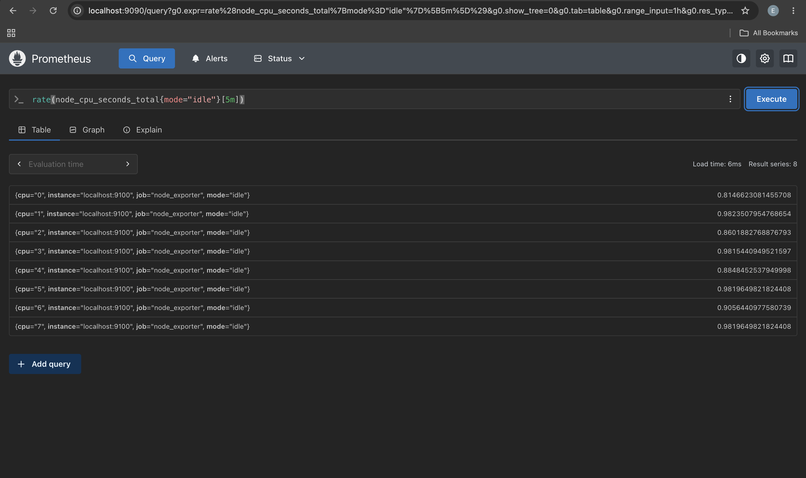
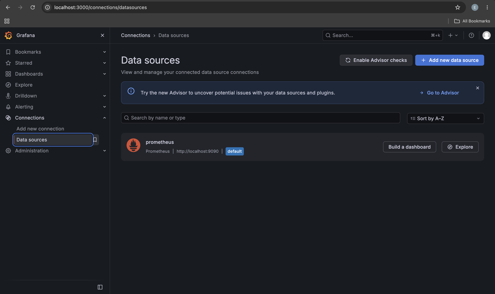
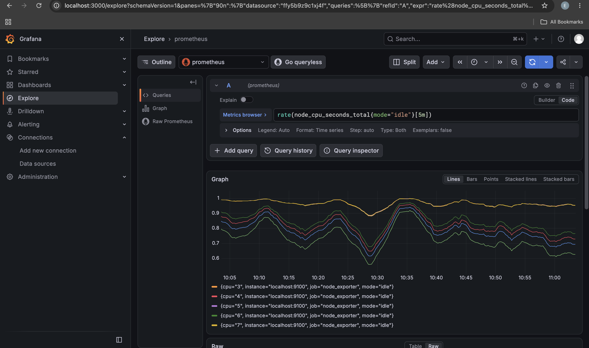
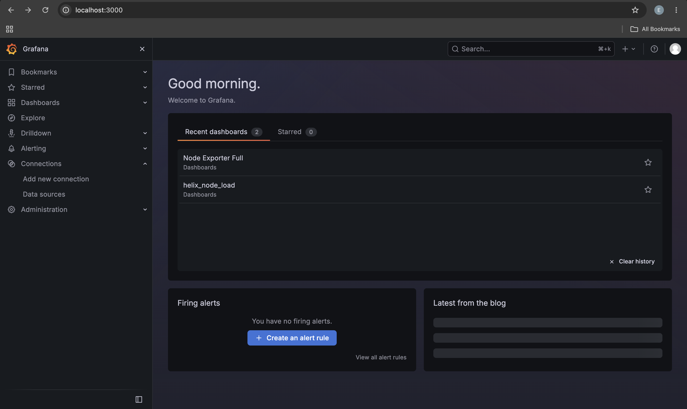
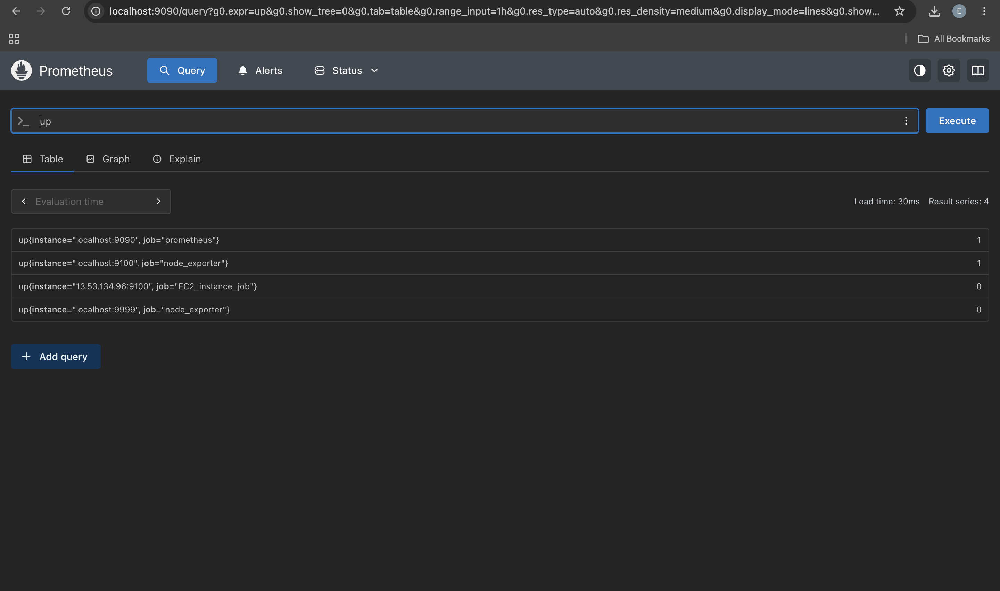
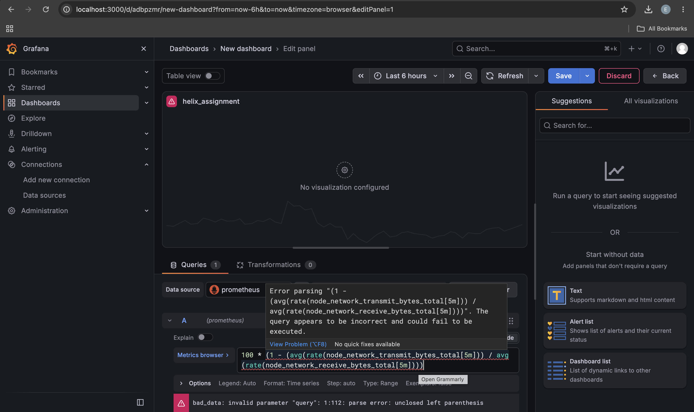

# Prometheus & Grafana Monitoring

A practical DevOps monitoring project that implements a complete Linux server monitoring solution using **Prometheus, Node Exporter, Grafana, and PromQL**.

The project demonstrates the workflow of:

**Install → Configure → Expose Metrics → Scrape Metrics → Verify Targets → Query with PromQL → Connect Grafana → Explore Metrics → Build Dashboard → Visualize → Troubleshoot → Document**

---

## 1. Project Overview

This project implements a basic monitoring and observability solution for a Linux server running in a WSL/Linux environment.

The solution collects Linux system metrics using **Node Exporter**, stores and queries those metrics using **Prometheus**, and visualizes them through **Grafana**.

The monitoring solution provides visibility into:

- CPU utilization
- Memory utilization
- Available memory
- Disk utilization
- Available disk space
- Network traffic
- System load
- Running processes
- System uptime

The project also demonstrates PromQL queries, Grafana Explore, dashboard creation, dashboard export, and troubleshooting of monitoring failures.

---

# 2. Architecture

The monitoring architecture follows this flow:

```text
┌──────────────────┐
│   Linux / WSL    │
│                  │
│  System Metrics  │
└────────┬─────────┘
         │
         ▼
┌──────────────────┐
│  Node Exporter   │
│                  │
│ Exposes metrics  │
│     :9100        │
└────────┬─────────┘
         │
         │ Scrape
         ▼
┌──────────────────┐
│    Prometheus    │
│                  │
│ Stores & queries │
│     :9090        │
└────────┬─────────┘
         │
         │ PromQL
         ▼
┌──────────────────┐
│     Grafana      │
│                  │
│ Visualization    │
│     :3000        │
└──────────────────┘
```

### Component Responsibilities

**Node Exporter** collects Linux system-level metrics and exposes them through an HTTP endpoint.

**Prometheus** periodically scrapes the Node Exporter endpoint, stores the resulting time-series data, and provides the PromQL query language for metric investigation.

**Grafana** connects to Prometheus as a data source and provides dashboards and visualizations for the collected metrics.

---

# 3. Technologies Used

- Linux / WSL
- Prometheus
- Node Exporter
- Grafana
- PromQL
- Git
- GitHub

---

# 4. Repository Structure

```text
prometheus-grafana-monitoring/
│
├── README.md
│
├── prometheus/
│   └── prometheus.yml
│
├── grafana/
│   └── dashboards/
│       └── linux-monitoring.json
│
└── screenshots/
    ├── 01-prometheus-running.png
    ├── 02-node-exporter-metrics.png
    ├── 03-prometheus-targets.png
    ├── 04-prometheus-query.png
    ├── 05-grafana-running.png
    ├── 06-grafana-datasource.png
    ├── 07-grafana-explore.png
    ├── 08-grafana-dashboard.png
    ├── 09-troubleshooting-prometheus.png
    └── 10-troubleshooting-grafana.png
```

---

# 5. Prometheus Installation & Configuration

## What is Prometheus?

Prometheus is an open-source monitoring and observability system designed to collect and store metrics as time-series data.

Prometheus periodically retrieves metrics from configured targets and stores them with timestamps and labels. These metrics can then be queried using PromQL.

Prometheus was used in this project as the central metrics collection and querying system.

## Prometheus Configuration

Prometheus was configured to scrape both itself and Node Exporter.

The configuration is stored in:

```text
prometheus/prometheus.yml
```

The configuration includes a 15-second scrape interval and two scrape jobs:

```yaml
global:
  scrape_interval: 15s

scrape_configs:

  - job_name: "prometheus"
    static_configs:
      - targets:
          - "localhost:9090"

  - job_name: "node"
    static_configs:
      - targets:
          - "localhost:9100"
```

### What is a scrape?

A **scrape** is the process where Prometheus sends an HTTP request to a configured target and retrieves the metrics exposed by that target.

For example, Prometheus scrapes Node Exporter at:

```text
http://localhost:9100/metrics
```

### What does `scrape_interval` do?

The `scrape_interval` determines how frequently Prometheus collects metrics from its configured targets.

In this project:

```yaml
scrape_interval: 15s
```

means Prometheus attempts to scrape the targets every 15 seconds.

### What does `job_name` mean?

`job_name` identifies and groups a set of targets performing the same monitoring role.

This project has:

- `prometheus` — Prometheus itself
- `node` — Node Exporter

### What are targets?

Targets are the endpoints that Prometheus monitors and scrapes.

In this project:

```text
localhost:9090
localhost:9100
```

are the Prometheus and Node Exporter targets respectively.

### Why does Prometheus scrape itself?

Prometheus exposes its own internal metrics. Scraping itself allows Prometheus to monitor its own health, performance, and internal activity.

### Why is Node Exporter needed?

Prometheus does not automatically expose detailed Linux operating-system metrics such as CPU, memory, filesystem, network, and system load.

Node Exporter collects these operating-system metrics and exposes them in a format Prometheus can scrape.

## Prometheus Running

The Prometheus web interface was verified to be running successfully.


---

# 6. Node Exporter

## What is Node Exporter?

Node Exporter is a Prometheus exporter that exposes hardware and operating-system metrics from a Linux system.

It provides metrics for resources such as:

- CPU
- Memory
- Filesystems
- Network interfaces
- System load
- Processes
- System uptime

Node Exporter exposes these metrics through:

```text
http://localhost:9100/metrics
```

## Node Exporter Metrics

At least five Node Exporter metrics were investigated.

### `node_cpu_seconds_total`

A counter representing the cumulative amount of CPU time spent in different CPU modes.

Examples of CPU modes include:

- `idle`
- `user`
- `system`
- `iowait`

Because this metric accumulates over time, `rate()` can be used to calculate how quickly the value is changing.

### `node_memory_MemTotal_bytes`

Represents the total amount of physical memory available to the system, measured in bytes.

### `node_memory_MemAvailable_bytes`

Represents the amount of memory that is currently available to applications without causing the system to start swapping heavily.

### `node_filesystem_avail_bytes`

Represents the amount of filesystem space available to non-root users.

### `node_load1`

Represents the system load average over the previous one-minute period.

## Node Exporter Metrics Evidence

The Node Exporter metrics endpoint was accessed successfully and Prometheus-formatted metrics were visible.



---

# 7. Prometheus Targets & Scraping

Prometheus was configured to scrape Node Exporter using:

```text
localhost:9100
```

The Prometheus Targets page was used to verify that the Node Exporter target was successfully being scraped.

A healthy target should have the state:

```text
UP
```

The target verification included:

- Job name
- Endpoint
- State
- Last scrape



---

# 8. Prometheus Metric Investigation

Prometheus's web interface was used to investigate the Linux server metrics using PromQL.

## CPU

The following query was investigated:

```promql
rate(node_cpu_seconds_total{mode="idle"}[5m])
```

This calculates the per-second rate of change of cumulative CPU idle time over the previous five minutes.

The result represents the fraction of time the CPU spent idle.

CPU utilization can therefore be calculated by subtracting the idle fraction from 1 and converting it to a percentage:

```promql
100 * (1 - avg by (instance) (
  rate(node_cpu_seconds_total{mode="idle"}[5m])
))
```

### CPU utilization calculation

```text
CPU utilization
= 100 × (1 − average CPU idle fraction)
```

For example, if the average idle fraction is `0.70`, CPU utilization is approximately:

```text
100 × (1 − 0.70) = 30%
```

## Memory

The following metrics were investigated:

```promql
node_memory_MemTotal_bytes
```

and:

```promql
node_memory_MemAvailable_bytes
```

Memory utilization was calculated as:

```promql
100 * (
  1 - (
    node_memory_MemAvailable_bytes
    /
    node_memory_MemTotal_bytes
  )
)
```

The calculation compares available memory with total memory and converts the resulting utilization fraction into a percentage.

## Disk

The following filesystem metrics were investigated:

```promql
node_filesystem_size_bytes
```

and:

```promql
node_filesystem_avail_bytes
```

Filesystem utilization was calculated as:

```promql
100 * (
  1 - (
    node_filesystem_avail_bytes
    /
    node_filesystem_size_bytes
  )
)
```

The calculation determines the proportion of filesystem capacity that is not available.

## Network

### Network Receive

```promql
rate(node_network_receive_bytes_total[5m])
```

This calculates the rate at which bytes are being received over the network during the previous five minutes.

### Network Transmit

```promql
rate(node_network_transmit_bytes_total[5m])
```

This calculates the rate at which bytes are being transmitted over the network during the previous five minutes.

Unlike memory and disk utilization, transmit and receive traffic should not be treated as "used versus available" values. They represent two different directions of network traffic.

## System Load

The following metrics were investigated:

```promql
node_load1
```

```promql
node_load5
```

```promql
node_load15
```

They represent system load averages over different time periods:

| Metric | Period |
|---|---|
| `node_load1` | 1 minute |
| `node_load5` | 5 minutes |
| `node_load15` | 15 minutes |

Comparing the three values helps identify whether system load is currently increasing, decreasing, or remaining relatively stable.

## Prometheus Query Evidence

The Prometheus web interface was used to execute PromQL queries and investigate the collected metrics.



---

# 9. PromQL Queries

PromQL (Prometheus Query Language) was used to retrieve, filter, calculate, and aggregate monitoring data.

The following queries demonstrate the use of `rate()`, `sum()`, label filtering, arithmetic, and aggregation.

---

## Query 1 — CPU Idle Rate

```promql
rate(node_cpu_seconds_total{mode="idle"}[5m])
```

**What it does:**  
Calculates the per-second rate of CPU idle time over the previous five minutes.

**Expected result:**  
A value between approximately `0` and `1` for each CPU core, representing the fraction of time that core has been idle.

---

## Query 2 — CPU Utilization

```promql
100 * (1 - avg by (instance) (
  rate(node_cpu_seconds_total{mode="idle"}[5m])
))
```

**What it does:**  
Calculates CPU utilization as a percentage by subtracting average CPU idle time from 100%.

**Expected result:**  
A percentage representing CPU utilization for the monitored instance.

---

## Query 3 — Total Memory

```promql
node_memory_MemTotal_bytes
```

**What it does:**  
Returns the total physical memory available to the system.

**Expected result:**  
Memory capacity in bytes.

---

## Query 4 — Memory Utilization

```promql
100 * (
  1 - (
    node_memory_MemAvailable_bytes
    /
    node_memory_MemTotal_bytes
  )
)
```

**What it does:**  
Calculates the percentage of memory currently being utilized.

**Expected result:**  
A percentage between `0` and `100`.

---

## Query 5 — Filesystem Utilization

```promql
100 * (
  1 - (
    node_filesystem_avail_bytes
    /
    node_filesystem_size_bytes
  )
)
```

**What it does:**  
Calculates filesystem utilization as a percentage.

**Expected result:**  
A percentage representing filesystem space currently in use.

---

## Query 6 — Network Receive Rate

```promql
rate(node_network_receive_bytes_total[5m])
```

**What it does:**  
Calculates the incoming network traffic rate.

**Expected result:**  
Bytes received per second.

---

## Query 7 — Network Transmit Rate

```promql
rate(node_network_transmit_bytes_total[5m])
```

**What it does:**  
Calculates the outgoing network traffic rate.

**Expected result:**  
Bytes transmitted per second.

---

## Query 8 — Label Filtering

```promql
node_cpu_seconds_total{mode="idle"}
```

**What it does:**  
Uses label filtering to select only CPU metrics where the `mode` label is `idle`.

**Expected result:**  
CPU idle-time series for the available CPU cores.

---

## Query 9 — Sum

```promql
sum(node_memory_MemAvailable_bytes)
```

**What it does:**  
Uses `sum()` to aggregate available memory across the returned series.

**Expected result:**  
The combined available memory represented by the matching series.

---

## Query 10 — Aggregation by Instance

```promql
avg by (instance) (
  rate(node_cpu_seconds_total{mode="idle"}[5m])
)
```

**What it does:**  
Calculates the average CPU idle rate for each monitored instance.

**Expected result:**  
One average CPU idle value per instance.

---

# 10. Grafana Installation

Grafana was installed and configured to run locally.

The Grafana web interface was accessed through:

```text
http://localhost:3000
```


---

# 11. Grafana Data Source

## What is a Grafana Data Source?

A Grafana data source is a backend system from which Grafana retrieves data for visualization.

Prometheus was configured as the Grafana data source because Prometheus stores the time-series metrics collected from Node Exporter and supports PromQL.

The local Prometheus endpoint was configured as:

```text
http://localhost:9090
```

This allows Grafana to execute PromQL queries against Prometheus and use the returned metrics in panels and dashboards.

## Data Source Verification

The Prometheus data source was tested successfully from Grafana.



---

# 12. Grafana Explore

Grafana Explore was used to investigate Prometheus metrics independently of the final dashboard.

The following metric categories were investigated:

- CPU
- Memory
- Disk
- Network
- System load

## What is Grafana Explore?

Grafana Explore is an interactive interface for querying and investigating data sources directly.

A DevOps engineer can use Explore when:

- Investigating an incident
- Testing a PromQL query
- Troubleshooting unexpected metric values
- Exploring a metric before adding it to a dashboard
- Performing ad-hoc analysis

Explore is particularly useful during troubleshooting because it allows queries to be tested without modifying the permanent dashboard.

A dashboard is more appropriate when the goal is to provide a reusable, organized monitoring view for regular observation.

## Explore Evidence

Grafana Explore was used to execute PromQL queries and verify their results.



---

# 13. Grafana Dashboard

A Grafana dashboard named:

```text
Linux Server Monitoring
```

was created.

The dashboard contains the required ten monitoring panels.

## Dashboard Panels

### 1. CPU Usage

**Visualization:** Time series

Displays CPU utilization percentage over time.

```promql
100 * (1 - avg by (instance) (
  rate(node_cpu_seconds_total{mode="idle"}[5m])
))
```

A time series was selected because CPU utilization is a metric whose changes over time are important when identifying spikes and sustained CPU pressure.

---

### 2. Memory Usage

**Visualization:** Gauge

Displays current memory utilization percentage.

```promql
100 * (
  1 - (
    node_memory_MemAvailable_bytes
    /
    node_memory_MemTotal_bytes
  )
)
```

A gauge was selected because memory utilization is naturally interpreted as a percentage of total capacity.

---

### 3. Available Memory

**Visualization:** Stat

Displays currently available memory.

```promql
node_memory_MemAvailable_bytes
```

A Stat visualization was selected because the primary requirement is to quickly see the current available-memory value rather than its historical trend.

---

### 4. Disk Usage

**Visualization:** Gauge

Displays filesystem utilization percentage.

```promql
100 * (
  1 - (
    node_filesystem_avail_bytes
    /
    node_filesystem_size_bytes
  )
)
```

A gauge was selected because disk usage represents the percentage of available storage capacity currently consumed.

---

### 5. Available Disk

**Visualization:** Stat

Displays currently available filesystem space.

```promql
node_filesystem_avail_bytes
```

A Stat panel provides a quick view of the current available disk capacity.

---

### 6. Network Receive

**Visualization:** Time series

Displays incoming network traffic over time.

```promql
rate(node_network_receive_bytes_total[5m])
```

A time series is appropriate because network traffic is continuously changing and traffic spikes are useful operational information.

---

### 7. Network Transmit

**Visualization:** Time series

Displays outgoing network traffic over time.

```promql
rate(node_network_transmit_bytes_total[5m])
```

A time series makes it possible to identify changes and spikes in outgoing network activity.

---

### 8. System Load

**Visualization:** Time series

Displays:

```promql
node_load1
```

```promql
node_load5
```

```promql
node_load15
```

The three metrics are displayed together so that short-, medium-, and longer-term system load can be compared.

A time series was selected because the trend of system load is more useful than viewing only the current value.

---

### 9. Running Processes

**Visualization:** Stat

```promql
node_procs_running
```

Displays the number of processes currently running.

A Stat visualization provides a quick indication of the current process count.

---

### 10. System Uptime

**Visualization:** Stat

```promql
node_time_seconds - node_boot_time_seconds
```

Displays the amount of time the system has been running since its last boot.

A Stat visualization was selected because uptime is primarily a current-value metric.

---

## Dashboard Organization

The dashboard was organized so that important system health information can be understood quickly.

The layout groups related metrics together:

```text
Linux Server Monitoring

CPU          Memory          Disk

CPU Usage

Memory Usage

Network Receive       Network Transmit

System Load

Processes             Uptime
```

The dashboard uses different visualization types according to the nature of each metric instead of using the same visualization for every panel.

## Dashboard Evidence

The completed Grafana dashboard containing the required monitoring panels is shown below.



---

# 14. Dashboard Time Range

The dashboard supports changing the monitoring time range.

The dashboard was tested using:

- Last 5 minutes
- Last 15 minutes
- Last 1 hour
- Last 6 hours

Changing the time range allows the same dashboard to be used for both short-term troubleshooting and longer-term monitoring.

For example:

- **Last 5 minutes** — useful for investigating a current incident
- **Last 15 minutes** — useful for recent system activity
- **Last 1 hour** — useful for identifying short-term trends
- **Last 6 hours** — useful for identifying broader activity patterns

The panels respond to the selected dashboard time range.

---

# 15. Dashboard Refresh

Automatic dashboard refresh was configured using a reasonable refresh interval.

A monitoring dashboard does not necessarily need to refresh every second because doing so can create unnecessary queries and processing overhead without providing meaningful additional information.

For most infrastructure monitoring situations, refreshing every 10 or 30 seconds provides sufficiently current information while reducing unnecessary load on the monitoring system.

---

# 16. Dashboard Export

The completed dashboard was exported as JSON and stored in the repository at:

```text
grafana/dashboards/linux-monitoring.json
```

The exported JSON represents the actual completed dashboard, including its panels, queries, visualizations, and dashboard configuration.

This allows the dashboard configuration to be version-controlled and recreated in another Grafana environment.

---

# 17. Troubleshooting

Three monitoring troubleshooting scenarios were completed.

---

## Challenge 1 — Node Exporter Target

### Problem

The Node Exporter Prometheus target was temporarily changed from:

```text
localhost:9100
```

to:

```text
localhost:9999
```

### Cause

Prometheus was attempting to scrape a port where Node Exporter was not running.

### How I identified the problem

The Prometheus Targets page showed that the Node Exporter target was no longer healthy.

The target state changed from:

```text
UP
```

to an unhealthy/down state because Prometheus could not successfully scrape the endpoint.

### Solution

The target was restored to:

```text
localhost:9100
```

Prometheus was then reloaded/restarted as required.

### Verification

The target returned to the `UP` state and Prometheus successfully resumed scraping Node Exporter.



---

## Challenge 2 — Grafana Data Source

### Problem

The Grafana Prometheus data source was temporarily configured with:

```text
http://localhost:9999
```

instead of:

```text
http://localhost:9090
```

### Error observed

Grafana was unable to successfully query the Prometheus server.

### Cause

The configured URL pointed to an incorrect port where Prometheus was not available.

### Solution

The data source URL was restored to:

```text
http://localhost:9090
```

### Verification

The Prometheus data source was tested again and successfully connected to Prometheus.



---

## Challenge 3 — Grafana Panel

### Problem

A temporary Grafana panel was created using an incorrect PromQL metric name.

### Query

An intentionally incorrect metric name was used.

### Expected result

The panel should return data from Prometheus when a valid metric name is used.

### Observed result

The panel did not display the expected metric data because the query referenced a metric that did not exist.

### Cause

The PromQL query contained an incorrect metric name.

### Solution

The query was corrected to use the appropriate Node Exporter metric.

### Verification

The corrected query returned the expected metric data and the panel displayed the result correctly.

---

# 18. Lessons Learned

This project provided practical experience with Prometheus, Node Exporter, Grafana, and PromQL.

### 1. Prometheus uses a pull-based monitoring model

Prometheus periodically scrapes configured targets instead of waiting for metrics to be pushed to it.

### 2. Node Exporter provides Linux system metrics

Node Exporter bridges the gap between the Linux operating system and Prometheus by exposing operating-system metrics in a Prometheus-compatible format.

### 3. PromQL allows metrics to be transformed and analyzed

PromQL can filter metrics using labels, calculate rates, perform arithmetic, and aggregate multiple time series.

### 4. Counters and gauges must be handled differently

Counter metrics such as:

```text
node_cpu_seconds_total
node_network_receive_bytes_total
node_network_transmit_bytes_total
```

typically require functions such as `rate()` when analyzing their change over time.

Gauge metrics such as memory availability and filesystem size represent current values and generally do not require `rate()`.

### 5. Grafana provides visualization on top of monitoring data

Grafana does not replace Prometheus. It provides a visualization and exploration layer that queries Prometheus and presents the resulting data through panels and dashboards.

### 6. Visualization should match the metric

Time series are useful for changing values such as CPU and network traffic, while Stat panels are useful for current values such as uptime and available memory. Gauges are useful for percentage-based capacity metrics.

### 7. Troubleshooting requires checking each layer

A monitoring problem can occur at different points in the pipeline:

```text
Node Exporter
      ↓
Prometheus Target
      ↓
Prometheus Query
      ↓
Grafana Data Source
      ↓
Grafana Panel
```

Testing each layer helps identify where the failure occurs.

---

# 19. Challenges Encountered

## Challenge 1 — Understanding PromQL utilization calculations

One challenge was understanding how to convert raw Node Exporter metrics into meaningful utilization percentages.

For example, memory utilization requires comparing available memory against total memory rather than simply using the available-memory value.

The general calculation is:

```text
Utilization = 100 × (1 − Available / Total)
```

This approach was applied to memory and filesystem capacity metrics.

---

## Challenge 2 — Understanding counters versus gauges

Another challenge was understanding why some metrics require `rate()` while others do not.

For example:

```promql
rate(node_network_receive_bytes_total[5m])
```

is appropriate because the network metric is a cumulative counter.

In contrast:

```promql
node_memory_MemAvailable_bytes
```

is a gauge representing the current value and does not require `rate()`.

---

## Challenge 3 — Troubleshooting monitoring components

The troubleshooting challenges demonstrated that monitoring failures can occur because of incorrect endpoints, incorrect data-source configuration, or invalid PromQL.

Testing these failures and restoring the correct configurations provided practical experience diagnosing issues across the monitoring stack.

---

# 20. Final Monitoring Workflow

The completed project demonstrates the following DevOps monitoring workflow:

```text
Install
   ↓
Configure
   ↓
Expose Metrics
   ↓
Scrape Metrics
   ↓
Verify Targets
   ↓
Query with PromQL
   ↓
Connect Grafana
   ↓
Use Explore
   ↓
Build Dashboard
   ↓
Visualize Metrics
   ↓
Test Time Ranges
   ↓
Configure Refresh
   ↓
Export Dashboard
   ↓
Troubleshoot
   ↓
Document
   ↓
Push to GitHub
```

---

# 21. Conclusion

This project implemented a complete basic Linux monitoring solution using Prometheus, Node Exporter, and Grafana.

Node Exporter collected Linux system metrics, Prometheus scraped and stored those metrics, PromQL was used to investigate and calculate system performance indicators, and Grafana provided interactive exploration and a centralized monitoring dashboard.

The project also demonstrated monitoring troubleshooting by intentionally introducing configuration and query errors, identifying their causes, correcting them, and verifying that the monitoring system returned to a healthy state.

The final repository contains the Prometheus configuration, exported Grafana dashboard, screenshots, PromQL queries, troubleshooting documentation, and this README.

---
